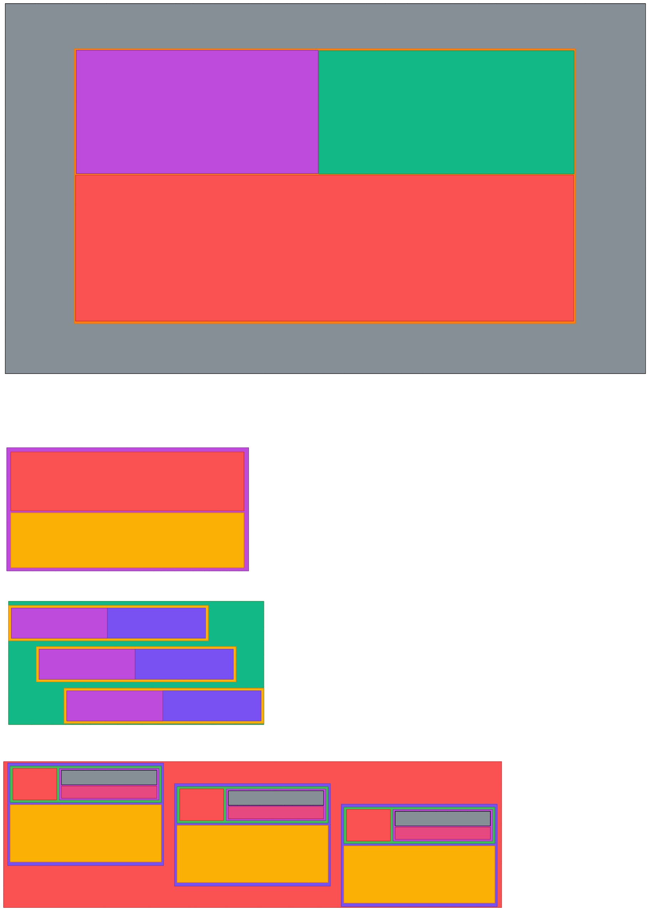
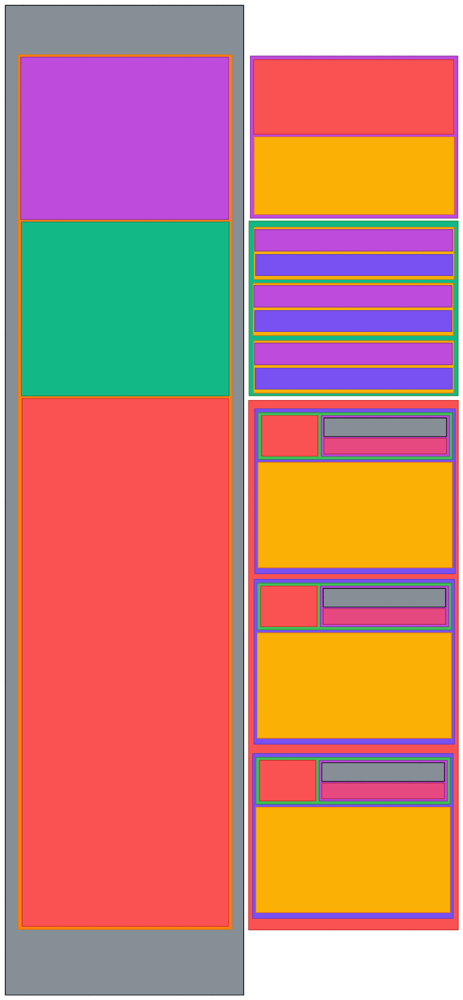

# Frontend Mentor - Social proof section

A year or so ago I tried to complete this project, but could not. Since then, my abilities in HTML, CSS and accessibilityhave improved drastically, so I will finish the project.

## Desktop design

Sketch of the structure of the desktop version:

## Mobile design

Sketch of the structure of the mobile version:

